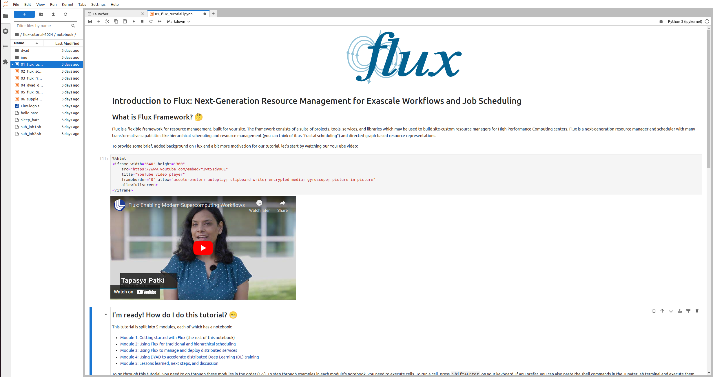

# Flux Framework Tutorials

This repository contains our slides and materials for Flux Framework tutorials. 

## Design

### Autoscaling Jupyter Hub

We deploy a Jupyter Hub that spawns individual containers, one per tutorial participant. Participants can login
to a web-based portal with a password and username of their choosing to start the chapter-oriented sections.

### Content

While we change the tutorial over time, the content generally consists of two kinds of learning.

#### Presentation

Our presentations vary by year, and we try to make them interesting and engaging, teaching about Flux and highlighting new features.
A few examples:

This presentation from RADIUSS 2023 can [be seen here](https://github.com/flux-framework/Tutorials/blob/master/2023-RADIUSS-AWS/Flux_RADIUSS_Tutorial_2023.pdf). Individual presentations can include (but are not limited to) content from our [learning guide](https://flux-framework.readthedocs.io/en/latest/guides/learning_guide.html) and introduction to [Flux Components](https://flux-framework.readthedocs.io/en/latest/guides/components.html).

#### Interactive Learning

To best learn about using Flux, we offer several beginner chapters for job submission and interaction with Flux Framework.
The chapters are also interspersed with more design or "how does it work" type content for the interested reader. A few screenshots are shown below.

